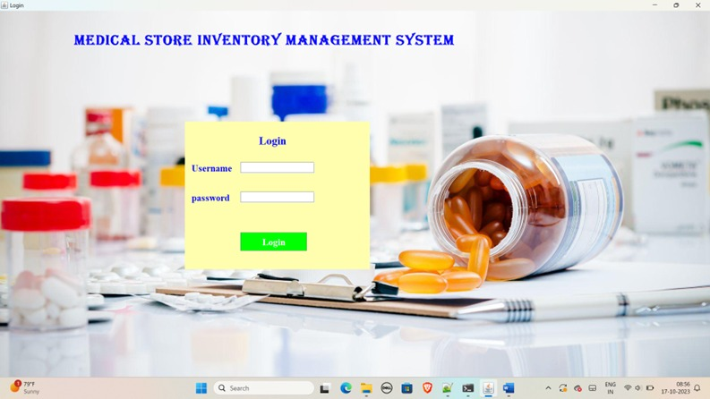
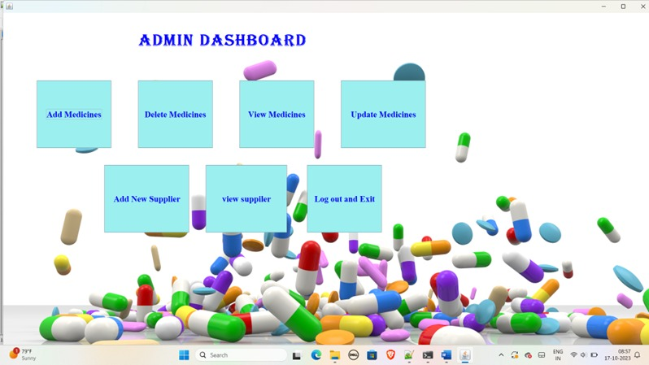
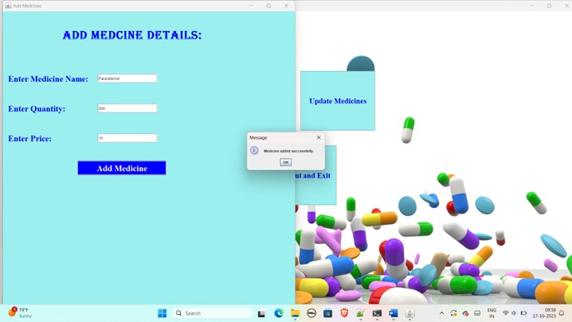

# 🏥 Medical Store Inventory Management System


A **Java Swing + MySQL desktop application** to manage medicines, suppliers, and inventory efficiently.  
Supports **CRUD operations**, **inventory tracking**, and a **clean admin dashboard** — ideal for small medical shops or pharmacy management.

---

## ✨ Features

### 🔒 User Authentication
- Admin login
- Secure access to dashboard

### 💊 Medicine Management
- Add, update, and delete medicines
- View all medicines in a table

### 🏢 Supplier Management
- Add suppliers
- View supplier list

### 📊 Dashboard
- Clickable cards for all modules
- Smooth navigation

### 🗄️ Database Integration
- MySQL backend
- CRUD operations via JDBC

---

## 🛠 Tech Stack

### Frontend (GUI)
- Java Swing
- AWT
- Custom panels & styled components

### Backend
- Java (Core + OOP + JDBC)
- MySQL Database

### Tools & Libraries
- MySQL Connector/J
- IntelliJ IDEA / Eclipse / VS Code
- Java JDK 8+

---

## ⚙ Prerequisites

- Java JDK 8+
- MySQL Server
- MySQL Workbench 
- MySQL Connector/J (JDBC driver)

---

## 🚀 Setup Instructions

### 1️⃣ Clone the repository
```bash
git clone https://github.com/mayuri-dorale/MedicalStoreInventory.git
```

### 2️⃣ Use the Database

```sql
USE medical_store;
```

### 3️⃣ Create Tables
#### Medicines Table

```sql
CREATE TABLE medicines (
  id INT AUTO_INCREMENT PRIMARY KEY,
  name VARCHAR(255) NOT NULL,
  quantity INT NOT NULL,
  price DOUBLE NOT NULL
);
```

#### Supplier Table

```sql
CREATE TABLE supplier (
  id INT AUTO_INCREMENT PRIMARY KEY,
  name VARCHAR(255) NOT NULL,
  email VARCHAR(255),
  comName VARCHAR(255)
);
```

### 4️⃣ Notes

* Ensure your MySQL server is running.
* Update your **database username and password** in `DBConnection.java` according to your setup:

```java
private static final String USER = "root";   // Replace with your MySQL username
private static final String PASS = "root";   // Replace with your MySQL password
```


## ▶ How to Run the Project

### IntelliJ IDEA
1. Open the project → File → Open → Select project folder
2. Add MySQL Connector:  
   File → Project Structure → Modules → Dependencies → Add JAR
3. Set Main class → Run  

✅ Login window appears → Dashboard opens

### Eclipse
1. File → New Java Project → Import `src` folder
2. Add MySQL Connector:  
   Right-click project → Build Path → Add External JARs
3. Right-click `Main.java` → Run As → Java Application

### VS Code
Add JAR support in `.vscode/settings.json`:
```json
{
  "java.project.referencedLibraries": [
    "lib/**/*.jar"
  ]
}
```
Run Main.java.

### Terminal
- Compile
javac -cp "lib/mysql-connector-j.jar;." src/**/*.java
- Run
java -cp "lib/mysql-connector-j.jar;src" Main


## 📸 Screenshots

## 📸 Screenshots

  
  



💡 This project helps pharmacies maintain efficient inventory management, ensure medicine availability, and streamline daily operations.

--- 
### 📝Mayuri Dorale
- AI & Data Science Engineering
- Passionate about full-stack + AI applications
- 📧 mayuridorale8@gmail.com
